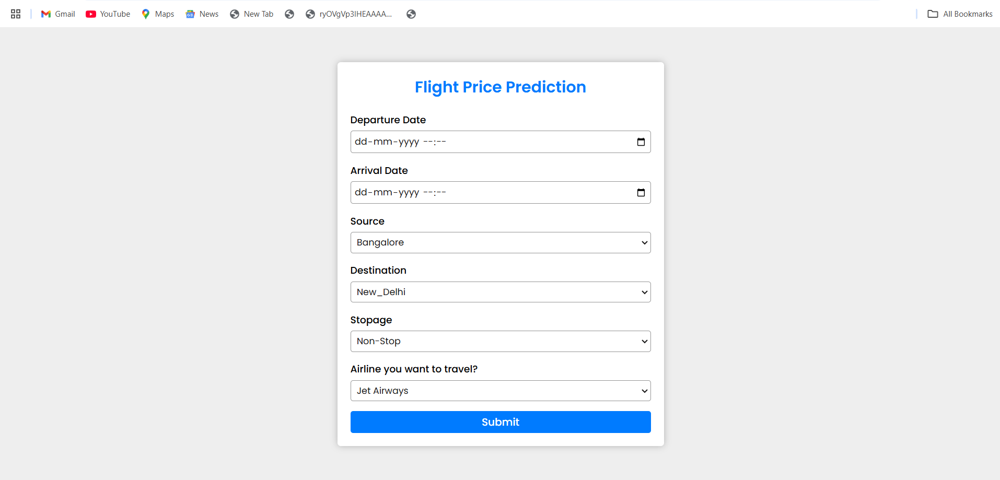

# Flight Price Prediction Project


## Table of Contents
1. [Project Overview](#project-overview)
2. [Demo](#demo)
2. [Motivation](#motivation)
2. [Key Features](#key-features)
3. [Dataset Features](#dataset-features)
4. [Folder Structure](#folder-structure)
5. [Installation](#installation)
6. [Usage](#usage)

## Project Overview
This project aims to predict the price of a flight ticket based on 
several key features like departure and arrival times,the source and destination cities,thr number of stops,and the airline.Once the user submits the information,the Flask app process the data,feed it to trained machine learning model,and displays the predicted ticket price in real time.

## Demo


## Motivation
Flight ticket prices can be unpredictable and vary based on several factors.This Project was created to provide users with a reliable way 
to predict flight ticket prices using machine learning,helping them make travel decisions and plan their journeys more effectively.

## Key Features

- **User Inputs**: Departure and arrival times, source and destination cities, number of stops, and airline.
- **Machine Learning Model**: Trained using RandomForestRegressor to predict flight prices.
- **Web Interface**: Built using Flask, where users can submit flight details and receive a price prediction.

## Dataset Features
### Raw Features
The raw dataset contains the following features:

- **Airline**: Name of the airline (e.g., "Jet Airways", "IndiGo").
- **Date_of_Journey**: The departure date and time of the flight.
- **Source**: The departure city (e.g., "Delhi", "Chennai").
- **Destination**: The arrival city (e.g., "New Delhi", "Hyderabad").
- **Route**: The route taken by the flight.
- **Dep_Time**: Departure time of the flight.
- **Arrival_Time**: Arrival time of the flight.
- **Duration**: Duration of the flight.
- **Total_Stops**: Number of stops (0 for direct, 1 for one stop, etc.).
- **Additional_Info**: Additional information about the flight (e.g., "No info").
- **Price(Target)**: The target variable representing the price of the flight.

### Processed Features
For the machine learning model, the following processed features were used:

- **Journey Day/Month**: Extracted from the Date_of_Journey.
- **Departure Hour & Minute**: Extracted from Dep_Time
- **Arrival Hour & Minute**: Extracted from Arrival_Time
- **Source, Destination, Airline**: One-hot encoded.
- **Total Stops**:  Used directly as an integer feature.

## Technologies Used
- **Python**: Programming language for data processing and model building.
- **Flask**: Web framework for creating the web application.
- **Scikit-learn**: Machine learning library used for - model training and prediction.
- **Pandas**: Used for data manipulation and cleaning.
- **Numpy**: Used for numerical operations.
- **Pickle**: For saving and loading the trained model.
- **Matplotlib & Seaborn**: Used for visualizing data during analysis

## Folder Structure
```
├── static 
│   ├── style.css
├── template
│   ├── index.html
├── app.py
├── Data_Train.xlsx
├── flight_model.pkl
├── flight_price.ipynb
├── README.md
├── requirements.txt
```

## Installation
Follow these steps to get your development environment set up and start using the flight price prediction application:

1. Clone the Repository
```
git clone https://github.com/yourusername/flight-price-prediction.git 
```
2. Install the required dependencies:
```
pip install -r requirements.txt
```
## Usage
1. Run the Flask app with:
```
python app.py
```
2. Navigate to ```http://127.0.0.1:5000``` in your browser to use the web interface for predicting flight prices.

3. Fill in the flight details, and click "Submit" to view the predicted ticket price.